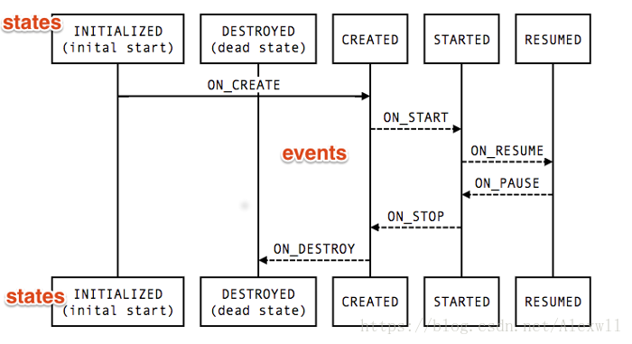

# JetPackSample
An android Jetpack sample project.

- Databinding
- Lifecycles
- LiveData
- Navigation
- Paging
- Room
- ViewModel
- WorkManager


#### Navigation 


1. Module中加入依赖

```
    dependencies {
        def nav_version = '1.0.0-alpha01'
        implementation "android.arch.navigation:navigation-fragment:$nav_version"
        implementation "android.arch.navigation:navigation-ui:$nav_version"
    }
```

2. 新建多个fragment

```
    class Page1Fragment : Fragment() {
    
        override fun onCreateView(inflater: LayoutInflater, container: ViewGroup?,
                                  savedInstanceState: Bundle?): View {
            return inflater.inflate(R.layout.fragment_page1, container, false)
        }
    }
    
    ·······································
    
    class Page2Fragment : Fragment() {

    override fun onCreateView(inflater: LayoutInflater, container: ViewGroup?,
                              savedInstanceState: Bundle?): View? {
        return inflater.inflate(R.layout.fragment_page2, container, false)
    }
}
```

3. 在res目录下新建navigation文件夹，然后新建一个navigation的resource文件, nav_graph_main.xml, 声明导航行为路径

```

    <?xml version="1.0" encoding="utf-8"?>
    <navigation xmlns:android="http://schemas.android.com/apk/res/android"
        xmlns:app="http://schemas.android.com/apk/res-auto"
        xmlns:tools="http://schemas.android.com/tools"
        app:startDestination="@id/page1Fragment">
    
        <fragment
            android:id="@+id/page1Fragment"
            android:name="com.chenqiao.navigation.fragment.Page1Fragment"
            android:label="fragment_page1"
            tools:layout="@layout/fragment_page1">
            <action
                android:id="@+id/action_page2"
                app:destination="@id/page2Fragment"
                app:enterAnim="@anim/slide_right_in"
                app:exitAnim="@anim/slide_left_out"
                app:popEnterAnim="@anim/slide_left_in"
                app:popExitAnim="@anim/slide_right_out" />
        </fragment>
    
        <fragment
            android:id="@+id/page2Fragment"
            android:name="com.chenqiao.navigation.fragment.Page2Fragment"
            android:label="fragment_page2"
            tools:layout="@layout/fragment_page2">
            <action
                android:id="@+id/action_page1"
                app:enterAnim="@anim/slide_right_in"
                app:exitAnim="@anim/slide_left_out"
                app:popEnterAnim="@anim/slide_left_in"
                app:popExitAnim="@anim/slide_right_out"
                app:popUpTo="@id/page1Fragment" />
            <action
                android:id="@+id/action_page3"
                app:destination="@id/nav_graph_page3"
                app:enterAnim="@anim/slide_right_in"
                app:exitAnim="@anim/slide_left_out"
                app:popEnterAnim="@anim/slide_left_in"
                app:popExitAnim="@anim/slide_right_out" />
        </fragment>
    
        <navigation
            android:id="@+id/nav_graph_page3"
            app:startDestination="@id/page3Fragment">
            <fragment
                android:id="@+id/page3Fragment"
                android:name="com.chenqiao.navigation.fragment.Page3Fragment"
                android:label="fragment_page3"
                tools:layout="@layout/fragment_page3" />
        </navigation>
    
    </navigation>

```

4. 主Activity：

```
    class MainActivity : AppCompatActivity() {
    
        override fun onCreate(savedInstanceState: Bundle?) {
            super.onCreate(savedInstanceState)
            setContentView(R.layout.activity_main)
        }
    
        override fun onSupportNavigateUp() =
                findNavController(this, R.id.my_nav_host_fragment).navigateUp()
    }

```

5. 通过以下API进行的控制：

```
    Navigation.findNavController(params).navigateUp();
    Navigation.findNavController(params).navigate(actionId);
```


#### Lifecycle



